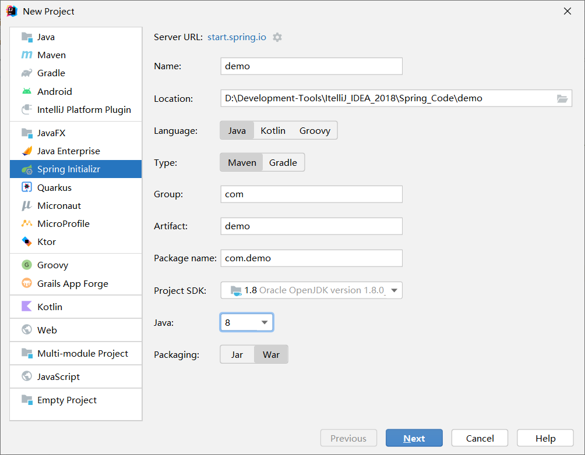
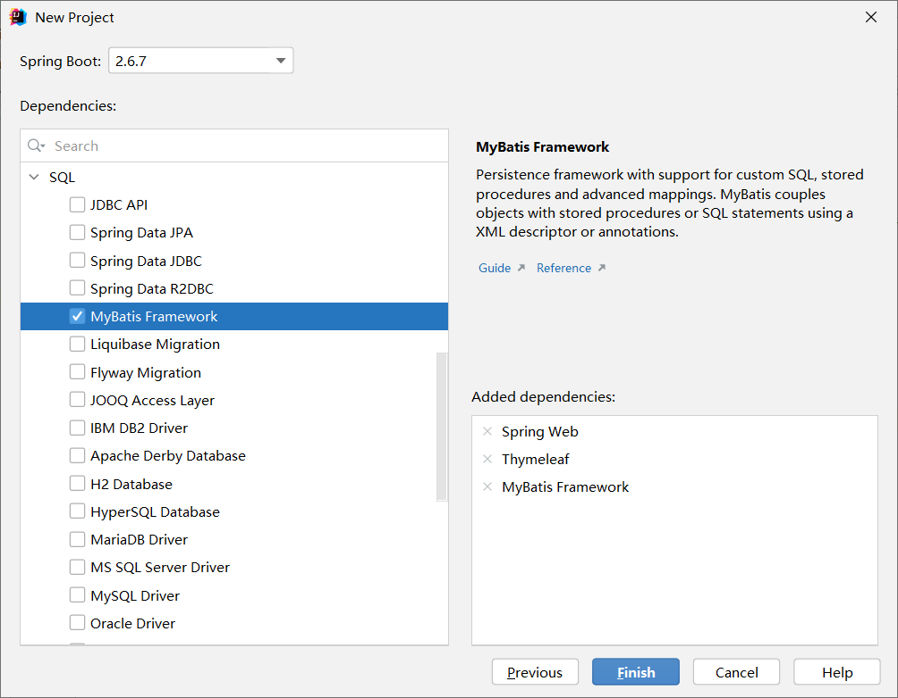
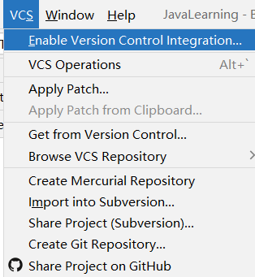
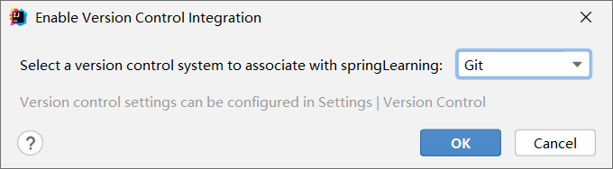
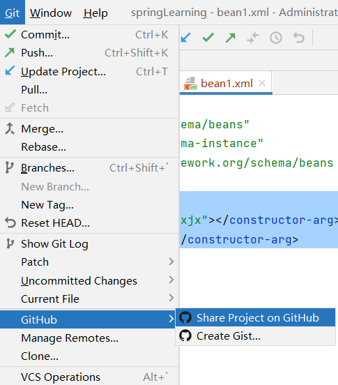
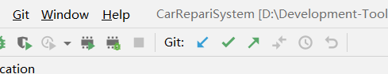
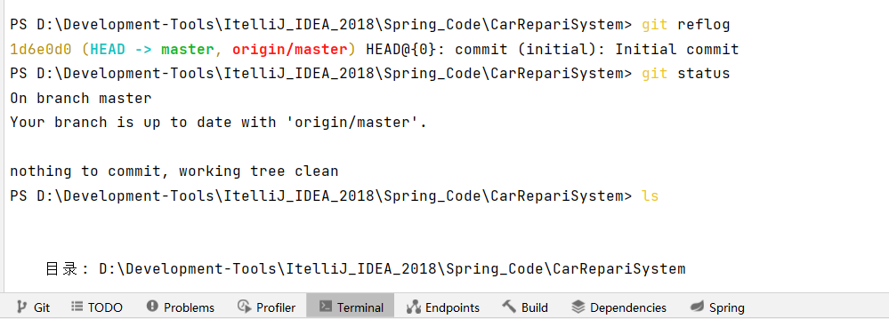

# 新建项目







## 项目启动测试

出现如下错误：

 Failed to configure a DataSource: ‘url’ attribute is not specified and no embedded datasource could be configured. 

在 SpringBoot 应用程序启动时，排除 jdbc 的自动装配机制即可，在程序入口文件中新增配置注解 “ exclude=DataSourceAutoConfiguration.class ” ，如下图：

```java
exclude= DataSourceAutoConfiguration.class
```


## Git版本控制

1. 


2. 
3. 

4. 点击commit完成初始化commit
5. 


6. 可以在终端正常使用git语句
7. 


> 想要将本地代码上传至[github](https://so.csdn.net/so/search?q=github&spm=1001.2101.3001.7020)上时，发现一直报错：Failed to connect to github.com port 443: Timed out。试了网上的很多方法都没有解决，最后发现是自己的vpn搞的鬼！！！把它关掉就好了，小伙伴们可以试试！！！

git commit是将本地修改过的文件提交到本地库中。

git push是将本地库中的最新信息发送给远程库。

